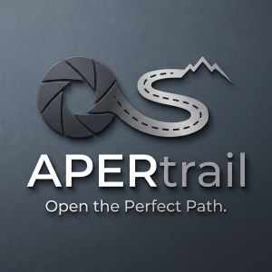

# APERtrail - Open the perfect path

<div align="center">
   
</div>

## Overview

A [Technosoftware GmbH](https://technosoftware.com) product, part of
[TRAILsuite](https://github.com/technosoftware-gmbh/TRAILsuite).

The first dedicated travel planner for photography. Map journeys that rotate around vantage points, light, and perspective.

APERtrail is an Obsidian plugin that models a journey as plain Markdown notes: one note per Trip, a Country / State / City hierarchy underneath, and five kinds of reusable place note (accommodation, food & beverages, landmarks, locations, photo spots). A Trip carries its participants, the cities it touches, a timed itinerary of stops, the nights it books, and its transport legs, all edited from the trip note itself. It also carries what the whole thing costs: an estimate on each line while you are still planning, a booking note per thing once you book it, a budget per category, and the split between the people who went. Everything is browsed through one combined gallery and summarized on a dashboard per module.

Your notes are always the source of truth. APERtrail keeps no data of its own: every view is derived from the vault on each render, so nothing can silently drift out of step with what is on disk.

## Modules

The vault, and the plugin's own source, are organized as three modules, so the plugin can grow one piece at a time instead of one flat pile:

```
Trips/                      one note per trip
  Bookings/                 one note per booked thing
Places/                     everything a trip can point at
  Countries/ States/ Cities/
  Accommodation/ Food & Beverages/ Landmarks/ Locations/ Photo Spots/
CRM/
  People/ Companies/
```

All three ship today, and each has its own dashboard: Trips for what you are planning, Places for everything a trip points at, CRM for the people and companies behind them. CRM reads and creates Person and Company notes but keeps no contact list of its own -- both type values are settings, so these stay folders your vault already owned, spelled its own way. Order handling is a plausible later module, not code that exists.

All three folders sit at the vault root out of the box. One optional common-parent setting moves them together, so a vault that keeps everything under `4 Resources/Travel` is one field away.

## Documentation

Start at [docs/index.md](docs/index.md).

| If you want to... | Read |
|---|---|
| Install it, or try it on the sample vault | [Installation](docs/installation.md) |
| Walk through planning a first trip | [Usage](docs/usage.md) |
| Understand every feature in detail | [Features](docs/features/travel.md) |
| See the full settings surface | [Settings reference](docs/design/settings-reference.md) |
| Understand the note conventions it reads | [Data model](docs/design/data-model.md) |
| See how the plugin is put together | [Architecture](docs/design/architecture.md) |
| Understand how the money works | [Trip budget and bookings](docs/design/trip-budget-and-bookings.md) |
| See the sample vault it is shaped around | [Sample vault](docs/design/sample-vault.md) |
| Copy a starting shape for a note | [Templates](docs/templates/index.md) |

## Build

From this directory, or from the repository root with
`--workspace packages/apertrail` appended:

- `npm run dev` - watch build
- `npm run build` - typecheck + production build, into `main.js` here
- `npm run lint` / `npm run lint:fix`
- `npm run test` - unit tests

`npm install` is run once at the repository root and installs every package.
It also builds `packages/core`, which this package needs on disk before it will
typecheck: the root `npm run build` visits the plugins before the core, so after
a change to the core build it explicitly with
`npm run build --workspace packages/core`.

`./scripts/install-into-vault.sh /path/to/Vault` from the root copies the built
`main.js`, `styles.css` and `manifest.json` of both plugins into a vault.

## License

Copyright (c) 2026 Technosoftware GmbH, Switzerland. PolyForm Noncommercial
License 1.0.0; see [`LICENSE`](LICENSE) and [`NOTICE.md`](NOTICE.md).
