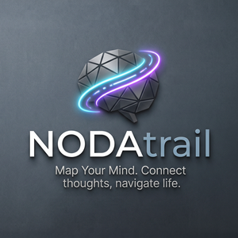

<p align="center">
  
</p>

# NODAtrail

**Map your mind.** A life OS for Obsidian, built on PARA: the areas you
maintain, the goals they serve, the projects that advance them, and the daily,
weekly, monthly, quarterly and yearly notes you plan them in. Plus the money
that belongs to none of it: the purchases, the bills, the standing charges and
the budget they are measured against.

Part of [TRAILsuite](../../README.md), beside
[APERtrail](../apertrail/README.md) for travel and
[CULItrail](../culitrail/README.md) for the kitchen. All three share one
library and one folder of Person and Company notes, and none of them depends on
another at runtime.

## What it covers

| | |
|---|---|
| **PARA** | Areas, Goals, Projects and Resources, each its own note type, with an archive that is a folder rather than a flag |
| **Plan** | Five levels of periodic note, their navigation regenerated rather than typed, and a rollup of what each period actually holds |
| **Tasks** | Checkbox lines in the Obsidian Tasks format, gathered out of your own notes. NODAtrail reads them and can tick one; it does not own them |
| **Finance** | Purchases, bills linked to the invoice PDFs already in your vault, recurring costs projected forward, and budgets per period |

## What it deliberately does not do

- It does not read CULItrail's orders or APERtrail's bookings. Each plugin
  answers "what did I spend" about its own domain.
- It does not manage tasks. Recurrence, dependencies and the query language stay
  with the Tasks plugin.
- It fetches nothing from the network. No exchange rates, no bank feeds.
- It migrates nothing. A note whose type is wrong is reported by the health
  check and fixed by a command you run.

## Getting started

From the repository root:

```
npm install
npm run build --workspace packages/nodatrail
./scripts/install-into-vault.sh /path/to/Vault
```

Then enable NODAtrail in Obsidian's community plugin list. On first run it
seeds its folder settings, preferring a folder your vault already has over the
one it would otherwise have invented, and adopts the shared CRM settings from
APERtrail or CULItrail if either is installed.

## Documentation

- [`docs/index.md`](docs/index.md), where the rest of it starts.
- [`docs/design/architecture.md`](docs/design/architecture.md), the design and
  the reasoning behind it.

## Ownership

Copyright (c) 2026 Technosoftware GmbH, Switzerland
(<https://technosoftware.com>). Licensed under the PolyForm Noncommercial
License 1.0.0; see [`LICENSE`](LICENSE) and [`NOTICE.md`](NOTICE.md). Bug
reports go to
<https://github.com/technosoftware-gmbh/TRAILsuite/issues>, and anything else
to <support@technosoftware.com>.
